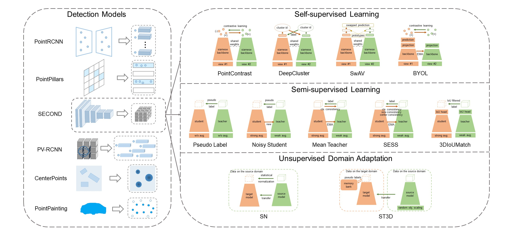

# ONCE Benchmark

This is a reproduced benchmark for 3D object detection on the [ONCE](https://arxiv.org/abs/2106.11037) (One Million Scenes) dataset. 

The code is mainly based on [OpenPCDet](https://github.com/open-mmlab/OpenPCDet).

## Introduction
We provide the dataset API and some reproduced models on the ONCE dataset. 

; 

; 

## Installation
The repo is based on OpenPCDet. If you have already installed OpenPCDet (version >= v0.3.0), you can skip this part and use the existing environment, but remember to re-compile CUDA operators by
```shell
python setup.py develop
cd pcdet/ops/dcn
python setup.py develop
```
If you haven't installed OpenPCDet, please refer to [INSTALL.md](docs/INSTALL.md) for the installation.

## Getting Started

Please refer to [GETTING_STARTED.md](docs/GETTING_STARTED.md) to learn more usage about this project.

## Benchmark

Please refer to this [page](https://once-for-auto-driving.github.io/benchmark.html#benchmark) for detailed benchmark results. We cannot release the training checkpoints, but it's easy to reproduce the results with provided configurations.

### Detection Models
We provide 1 fusion-based and 5 point cloud based 3D detectors. The training configurations are at `tools/cfgs/once_models/sup_models/*.yaml`

For PointPainting, you have to first produce segmentation results yourself. We used [HRNet](https://github.com/HRNet/HRNet-Semantic-Segmentation) trained on CityScapes to generate segmentation masks. 

Reproduced results on the validation split (trained on the training split):

| Method        | Vehicle | Pedestrian | Cyclist | mAP   |
| :-------------: | :-------: | :----------: | :-------: | :-----: |
| PointRCNN     | 52.09   | 4.28       | 29.84   | 28.74 |
| PointPillars  | 68.57   | 17.63      | 46.81   | 44.34 |
| SECOND        | 71.19   | 26.44      | 58.04   | 51.89 |
| PV-RCNN       | 77.77   | 23.50      | 59.37   | 53.55 |
| CenterPoints  | 66.79   | 49.90      | 63.45   | 60.05 |
| PointPainting | 66.17   | 44.84      | 62.34   | 57.78 |

### Semi-supervised Learning
We provide 5 semi-supervised methods based on the SECOND detector. The training configurations are at `tools/cfgs/once_models/semi_learning_models/*.yaml`

It is worth noting that all the methods are implemented by ourselves, and some are modified to attain better performance. Thus our implementations may be quite different from the original versions.

Reproduced results on the validation split (semi-supervised learning on the 100k raw_small subset):

| Method            | Vehicle | Pedestrian | Cyclist | mAP   |
| :-----------------: | :-------: | :----------: | :-------: | :-----: |
| baseline (SECOND) | 71.19   | 26.44      | 58.04   | 51.89 |
| Pseudo Label      | 72.80   | 25.50      | 55.37   | 51.22 |
| Noisy Student     | 73.69   | 28.81      | 54.67   | 52.39 |
| Mean Teacher      | 74.46   | 30.54      | 61.02   | 55.34 |
| SESS              | 73.33   | 27.31      | 59.52   | 53.39 |
| 3DIoUMatch        | 73.81   | 30.86      | 56.77   | 53.81 |

### Unsupervised Domain Adaptation

This part of the codes is based on [ST3D](https://github.com/CVMI-Lab/ST3D). Please copy the configurations at `tools/cfgs/once_models/uda_models/*` and `tools/cfgs/dataset_configs/da_once_dataset.yaml`, as well as the dataset file `pcdet/datasets/once/once_target_dataset.py` to the ST3D repo. The results can be easily reproduced following their instructions. 

| Task        | Waymo\_to\_ONCE | nuScenes\_to\_ONCE | ONCE\_to\_KITTI |
| :-----------: | :---------------: | :------------------: | :---------------: |
| Method      | AP\_BEV/AP\_3D  | AP\_BEV/AP\_3D     | AP\_BEV/AP\_3D  |
| Source Only | 65.55/32.88     | 46.85/23.74        | 42.01/12.11     |
| SN          | 67.97/38.25     | 62.47/29.53        | 48.12/21.12     |
| ST3D        | 68.05/48.34     | 42.53/17.52        | 86.89/41.42     |
| Oracle      | 89.00/77.50     | 89.00/77.50        | 83.29/73.45     |

## Citation 
If you find this project useful in your research, please consider cite:

```
@article{mao2021one,
  title={One Million Scenes for Autonomous Driving: ONCE Dataset},
  author={Mao, Jiageng and Niu, Minzhe and Jiang, Chenhan and Liang, Hanxue and Liang, Xiaodan and Li, Yamin and Ye, Chaoqiang and Zhang, Wei and Li, Zhenguo and Yu, Jie and others},
  journal={arXiv preprint arXiv:2106.11037},
  year={2021}
}
```
